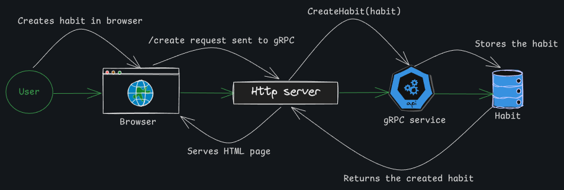

# routine-tracker

A gRPC-based habit tracking server written in Go. You define habits with a name and a weekly frequency target, then "tick" them each time you complete them.



## What it does

- Create habits with a name and optional weekly frequency (defaults to once/week)
- List all tracked habits
- Tick a habit to record a completion at the current timestamp
- Ticks are grouped by ISO 8601 week, so weekly progress is naturally scoped
- All state is held in-memory — no database required to run

## RPC API

Defined in `proto/service.proto`:

| RPC | Request | Response |
|---|---|---|
| `CreateHabit` | `name`, optional `weekly_frequency` | Created `Habit` |
| `ListHabits` | _(empty)_ | Array of `Habit` |
| `TickHabit` | `habit_id` | _(empty)_ |

A `Habit` message carries an `id` (UUID, server-assigned), `name`, and `weekly_frequency`.

## Project structure

```
.
├── proto/                        # Protobuf source definitions
│   ├── habit.proto               # Habit message type
│   └── service.proto             # Habits service + request/response messages
├── api/                          # Generated Go code — do not edit by hand
│   ├── habit.pb.go
│   ├── service.pb.go
│   └── service_grpc.pb.go
├── internal/
│   ├── habit/                    # Domain types and business logic
│   │   ├── habit.go              # Core Habit struct and type aliases
│   │   ├── create.go             # Create use-case (validate, fill, persist)
│   │   ├── list.go               # List use-case
│   │   ├── tick.go               # Tick use-case (find then record)
│   │   ├── errors.go             # InvalidInputError
│   │   └── mocks/                # minimock-generated mocks for unit tests
│   ├── isoweek/                  # ISO 8601 week key type used by the repository
│   ├── repository/               # Thread-safe in-memory store (habits + ticks)
│   └── server/                   # gRPC handler wiring (one file per RPC)
├── log/                          # Thin thread-safe logger wrapping stdlib log
├── cmd/
│   └── tracker/
│       └── main.go               # Binary entrypoint — wires everything together
├── go.mod
└── go.sum
```

## Running the server

```bash
cd routine-tracker-gRPC
go run ./cmd/tracker
```

The server listens on `127.0.0.1:28710` by default.

## Calling the API

Use any gRPC client (e.g. [grpcurl](https://github.com/fullstorydev/grpcurl)):

```bash
# Create a habit
grpcurl -plaintext -d '{"name": "Read", "weekly_frequency": 5}' \
  127.0.0.1:28710 habit.Habits/CreateHabit

# List all habits
grpcurl -plaintext 127.0.0.1:28710 habit.Habits/ListHabits

# Tick a habit (use the id returned from CreateHabit)
grpcurl -plaintext -d '{"habit_id": "<id>"}' \
  127.0.0.1:28710 habit.Habits/TickHabit
```

## Regenerating protobuf code

Requires `protoc`, `protoc-gen-go`, and `protoc-gen-go-grpc`.

```bash
protoc \
  --proto_path=proto \
  --go_out=api \
  --go_opt=paths=source_relative \
  --go-grpc_out=api \
  --go-grpc_opt=paths=source_relative \
  habit.proto service.proto
```

## Running tests

```bash
cd routine-tracker-gRPC
go test ./...
```

## Key design decisions

- Small, focused interfaces — each use-case only depends on the repository methods it actually needs (`habitCreator`, `habitFinder`, `tickAdder`, etc.), making unit testing straightforward without a full mock of the store.
- The `server` package is purely a translation layer — it converts proto types to domain types, calls the appropriate use-case function, and maps errors to gRPC status codes.
- Ticks are stored per ISO week key (`isoweek.ISO8601{Year, Week}`), so querying weekly completion is a simple map lookup.
- The logger interface (`Logf(format string, args ...any)`) is satisfied by both the production logger and `testing.T`, so tests get log output for free.

## Dependencies

| Package | Purpose |
|---|---|
| `google.golang.org/grpc` | gRPC runtime |
| `google.golang.org/protobuf` | Protobuf runtime |
| `github.com/google/uuid` | UUID generation for habit IDs |
| `github.com/gojuno/minimock/v3` | Mock generation for unit tests |
| `github.com/stretchr/testify` | Test assertions |
